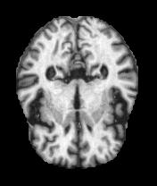
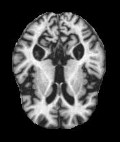
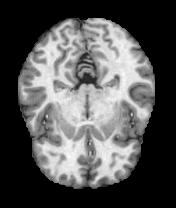
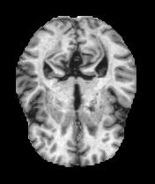
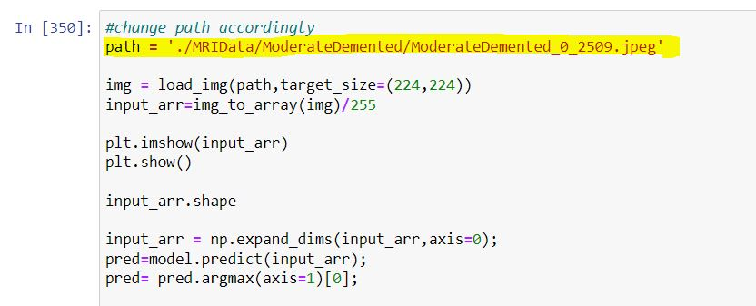

# Alzheimer's disease - Multiclass prediction using CNN

Alzheimer's disease is a progressive disorder in which dementia symptoms gradually worsen over time.Even though current Alzheimer's treatments cannot reverse the disease, they can temporarily slow the onset of dementia symptoms and enhance quality of life for those with Alzheimer's. Detecting Alzheimer's disease as soon as it begins is essential, as there is no way to reverse irreversible changes in the brain after they have occurred. Image processing plays a critical role in this process.

## Software
Jupyter Notebook (Python 3.9) - Installation details can be found [here](https://docs.jupyter.org/en/latest/install/notebook-classic.html#:~:text=Jupyter%20installation%20requires%20Python%203.3,%2C%20pip%2C%20instead%20of%20Anaconda.)

## Dependencies

Following libraries needs to be installed using the command  pip install "library name" 

- numpy
- matplotlib
- seaborn
- os
- math
- shutil
- random
- squarify
- tensorflow
- keras
- sklearn
- zipfile

## Dataset

The MRI scans dataset (*MRIData.zip*) is archived and uploaded into the Google drive.The link for the data is [here](https://drive.google.com/file/d/1df0NMnziOa9xe9-x6Tl_yNeKQAfrzwy4/view?usp=sharing).The folder must be downloaded from  and uploaded into the working diroctory of the notebook. It is essential that user upload the folder without extracting it, since extracting is covered in the code.

The Dataset consist of four classes:

Mild Demented            |  Moderate Demented           |  Non Demented        |  Very Mild Demented
:-------------------------:|:-------------------------: |:-------------------------: |:-------------------------:
  |   | | 

## Execution of code

Upload the *Alzheimer’s Multi Class Prediction.ipynb* into Jupyter notebook.

Before running the code the user must be connected to the *internet* as the code downloads the pre-trained model *MobileNet* which is used in the classification.

User can run all the code at once by following the below path :
- Cell > Run All

## Prediction

To predict the stage of Alzheimer's disease, user must provide the path of the intended MRI scan in the code as shown in the below snippet of the chunk. The MRI scan can be either the droped out image (not a part modelling or testing process) from original directory or any desired MRI scan.

## Run time

The approximate time to run the entire notebook is around 100 minutes.

## Authors

- [Varun Nagesh](https://github.com/ACM40960/project-20200599)
- [Ganapathy Uduvera Earappa](https://github.com/ACM40960/project-21200172)
